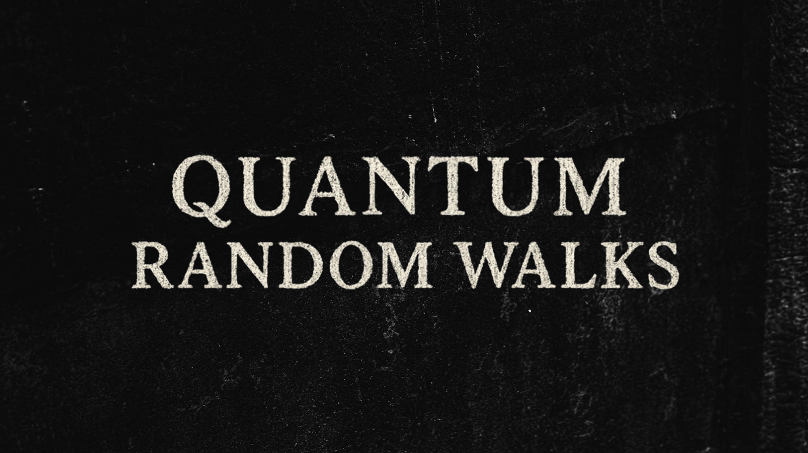
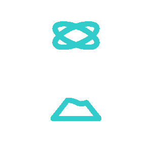
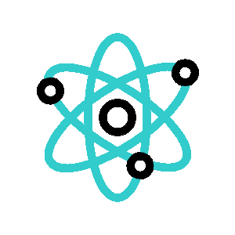

###   QUANTUM RANDOM WALLK - From nanoscience to quantum music.

###  INTRODUCTION

Hi! This project is created from two disciplines, (Nanoscience and Nanotechnology Introduction, and Mathematical Modelong), from the course od Postgraduation in Science and Technology by UFABC - Universade Federal do ABC, Santo André, SP, Brazil.

--

The project's objective is to demosntrates how nanoscale particles don't follow the rules of flassical physics, but probabilistic, using concepts about Quantum Computing, as a bridge to scientific experiments.

###  CONCEITOS A SEREM DESENVOLVIDOS

#### Caminhadas quânticas: 
uma ponte entre a nanociência, modelagem matemática e música.

#### Público-alvo: 
Estudantes do ensino médio com interesse em ciência, computação, matemática e música.

#### Fio condutor:
Explorar como partículas em nanoescala não seguem trajetórias clássicas, mas sim probabilísticas, e como isso pode ser modelado matematicamente por meio de random walks quânticos. O resultado é visualizado em padrões caóticos, aproximando o estudante de fenômenos reais da nanociência através de um recurso computacional acessível.

###   PROPOSTA DE DESENVOLVIMENTO

#### 1. Contextualização

Na nanociência, o estudo de partículas em dimensões extremamente pequenas exige modelos que considerem superposição, interferência e descoerência quântica. Essas propriedades são diferentes do mundo clássico e podem ser introduzidas aos alunos através de analogias com passeios aleatórios quânticos (quantum random walks).

Na modelagem matemática, os random walks quânticos podem ser descritos como versões discretas de equações diferenciais estocásticas, permitindo visualizar distribuições de probabilidade não triviais. A interação desses estados produz padrões que se aproximam de estruturas caóticas.

Por fim, estes padrões serão convertidos em uma música aleatória e caótica.


#### 2. Metodologia:

Introduzir conceitos básicos de nanociência (movimento de partículas, transporte em nanoestruturas, exemplo do grafeno) e diferenciar o modelo clássico do quântico.

Modelagem computacional: Mostrar o código em Python/Qiskit que simula o random walk quântico, explicando passo a passo.
Código de programação Python

Usando linguagem de programação Python, vamos simular, comparar, modelar e converter os parâmetros em diversas estruturas.

### Parâmetros do Quantum Random Walks

```
import numpy as np
import matplotlib.pyplot as plt
from qiskit import QuantumCircuit, transpile
from qiskit_aer import AerSimulator
from PIL import Image

n_steps = 20          # número de passos do walk
shots_per_step = 200  # número de execuções por passo
qubits_per_axis = 2   # 2 → 4 posições por eixo (grid 4x4)
grid_size = 2**qubits_per_axis

```

### Simulando um Quantum Random Walks

```

# Matriz acumulada de probabilidades
prob_matrix = np.zeros((grid_size, grid_size))

# Função para simular um passo quântico
def quantum_random_walk_step(prob_matrix, shots):
   qc = QuantumCircuit(2 * qubits_per_axis)
   qc.h(range(2 * qubits_per_axis))   # cria superposição em todos os qubits
   qc.measure_all()

   simulator = AerSimulator()
   compiled_circuit = transpile(qc, simulator)
   result = simulator.run(compiled_circuit, shots=shots).result()
   counts = result.get_counts()

   # Atualiza a matriz de probabilidades
   for bitstring, count in counts.items():
       # Divide os qubits no meio: metade → eixo X, metade → eixo Y
       x_bits = bitstring[:qubits_per_axis]
       y_bits = bitstring[qubits_per_axis:]

       # Converte binário para inteiro
       x = int(x_bits, 2)
       y = int(y_bits, 2)

       prob_matrix[x, y] += count
   return prob_matrix

```
### Convertendo dados em imagem
```
for _ in range(n_steps):
   prob_matrix = quantum_random_walk_step(prob_matrix, shots_per_step)


# Normalização para 0-255
prob_matrix = prob_matrix / np.max(prob_matrix) * 255
prob_matrix = prob_matrix.astype(np.uint8)


# Salvar imagem 

img = Image.fromarray(prob_matrix)
img = img.resize((1080, 1080), Image.BICUBIC)  # interpolação
img.save("quantum_random_walks.png")
```
Visualizando a imagem criada
```
plt.imshow(prob_matrix, cmap="inferno")  # em cmap poderia ser 'plasma'ou 'magma' também
plt.title("Quantum Random Walk")
plt.axis("off")
plt.show()
```

Visualização: Gerar a matriz de probabilidades e convertê-la em imagem fractalizada. Discussão: Relacionar os padrões visuais com fenômenos como difusão quântica em nanoescala, coerência e caos.

Imagem Resultante:


#### 3. Atividade prática

Alterar parâmetros do código (número de qubits, passos, shots).

Comparar a diferença entre o random walk clássico (simplesmente sorteando direções) e o quântico (usando superposição).

Observar como mudanças na simulação criam imagens distintas, conectando a matemática abstrata com fenômenos reais da nanociência.

Ao alterar o número de qubits, tivemos este 3 diferentes resultados.


#### 4. Transformando Imagem em som

Agora, o próximo passo foi utilizar a imagem resultante do experimento, a fim de converter seus pontos claros e escuros em sinais sonoros, gerando uma música completamente aleatória. 


#### Importando a Imagem (Imagem_Quantum_Random_Walks.png)

```
from PIL import Image
import numpy as np
from mido import Message, MidiFile, MidiTrack

# Carregar imagem

img = Image.open("Imagem_Quantum_Random_Walks.png").convert("L") 
data = np.array(img)

mid = MidiFile()
track = MidiTrack()
mid.tracks.append(track)
```

#### Convertendo Pixels em Notas Musicais
```
# Mapear pixels para notas (escala 60–84 = C4 a C6)
for x in range(0, data.shape[1], 10):  # percorre colunas (tempo)
   col = data[:, x]
   avg = int(np.mean(col))  # média da intensidade
   note = 60 + (avg * 24 // 255)  # mapeia para notas
   track.append(Message('note_on', note=note, velocity=64, time=120))
   track.append(Message('note_off', note=note, velocity=64, time=240))
```

#### Salvando o arquivo MIDI (áudio)
```
mid.save("quantum_music.mid")
print("Arquivo MIDI gerado: quantum_music.mid")
```

###   ARQUIVO MIDI

Agora possuímos o arquivo MIDI, podendo ser executado por Players de MIDI, pode ser manipulados em editores, ou ser convertido para outros formatos de áudio.


Para este projeto, abrimos o arquivo MIDI no programa Guitar Pro. Este reconheceu as notas MIDI, e definimos como um piano (por exemplo). Assim, temos uma partitura completa, como resultado de todos os processos anteriores.


###   ÁUDIO FINAL

Você pode escutar o áudio final no player abaixo:

https://github.com/user-attachments/assets/494e43b7-653e-43e8-bc82-0702a51b610c

###   Muito Obrigado!
